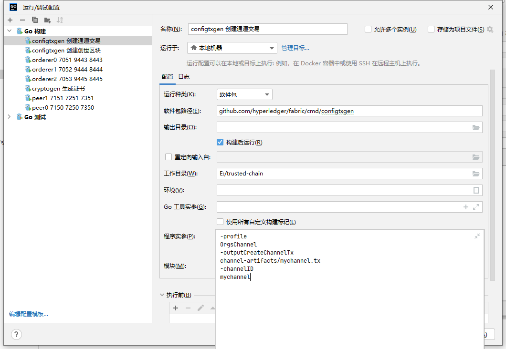
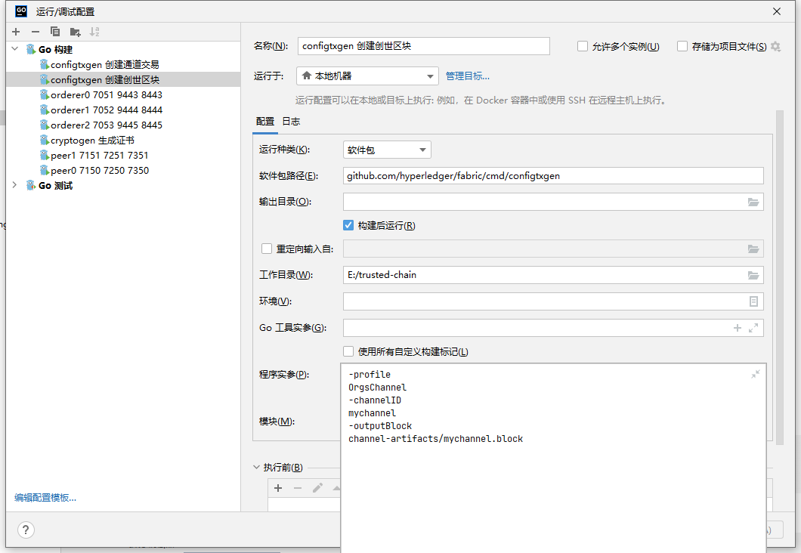
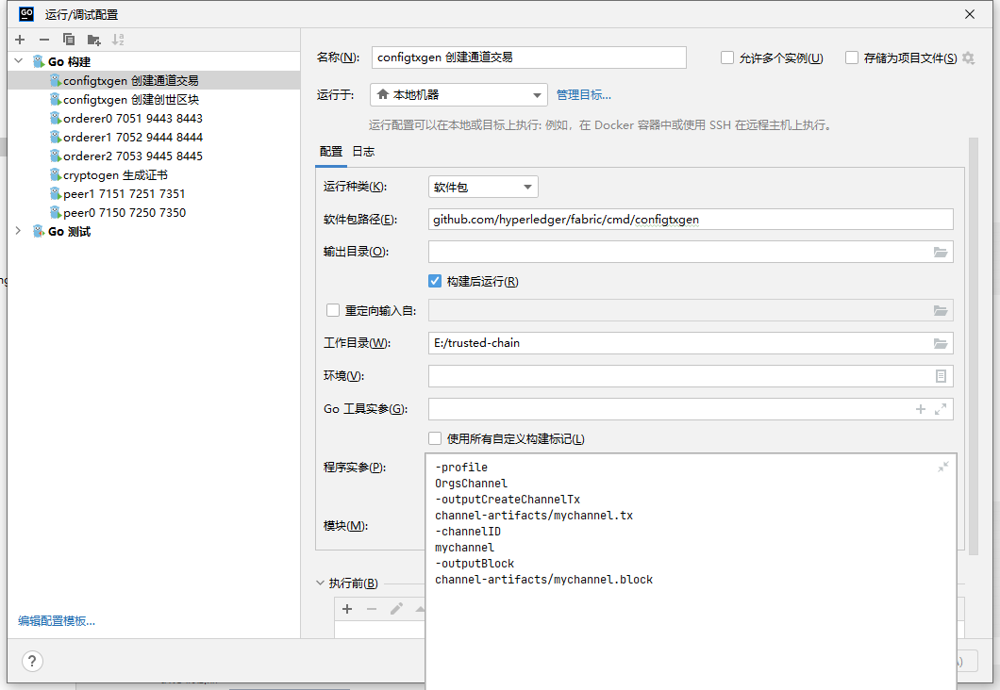

## configtxgen 工具

### 1、configtxgen工具入口

- [cmd/configtxgen/main.go](../../cmd/configtxgen/main.go)

### 2、使用configtxgen生成通道文件

- idea 启动

  
- 二进制文件

```shell
configtxgen
-profile OrgsChannel 
-outputCreateChannelTx channel-artifacts/mychannel.tx 
-channelID mychannel
```

### 3、使用configtxgen生成创始区块

- idea 启动



- 二进制文件

```shell
configtxgen
-profile OrgsChannel
-outputBlock channel-artifacts/mychannel.block
-channelID mychannel
```

### 4、配置文件

[configtx.yaml](../../samplewindowsconfig/configtx.yaml)

### 5、可以同时生成创始区块并生成通道文件

- 将两个变量同时配置即可

```shell
-profile
OrgsChannel
-channelID
mychannel
-outputCreateChannelTx
channel-artifacts/mychannel.tx
-outputBlock
channel-artifacts/mychannel.block
```

