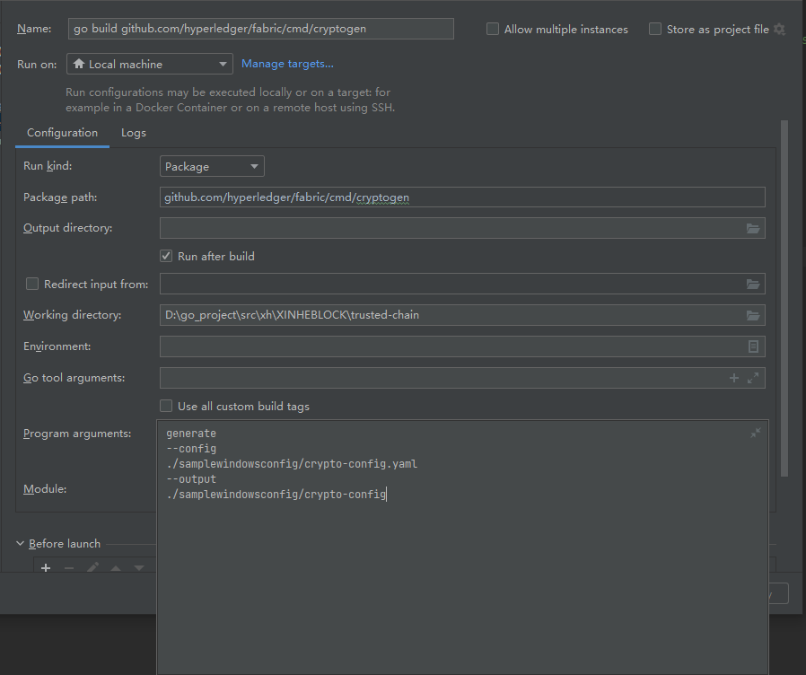

## cryptogen 工具

### 1、cryptogen工具入口
- [cmd/cryptogen/main.go](../../cmd/cryptogen/main.go)

### 2、使用cryptogen生成证书
- idea 启动
  
- 二进制文件
```shell
cryptogen generate
--config
./samplewindowsconfig/crypto-config.yaml
--output
./samplewindowsconfig/crypto-config
```