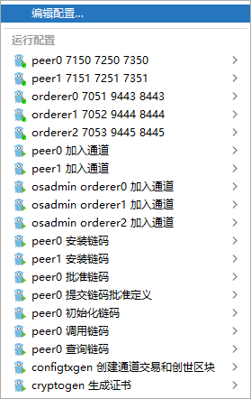

## Orderer 节点启动

### 1、orderer服务入口
- [cmd/orderer/main.go](../../cmd/orderer/main.go)

### 2、启动orderer服务

- 注意配置 hosts (`C:\Windows\System32\drivers\etc\hosts`)
```shell
127.0.0.1 peer0.org.dns.com
127.0.0.1 peer1.org.dns.com
127.0.0.1 orderer0.dns.com
127.0.0.1 orderer2.dns.com
127.0.0.1 orderer1.dns.com
127.0.0.1 chaincode.server.com 
```

- 使用`.run`目录下的idea启动文件启动

`.run/orderer0 7051 9443 8443.run.xml`

`.run/orderer1 7052 9444 8444.run.xml`

`.run/orderer2 7053 9445 8445.run.xml`




### 4、orderer服务启动过程中的处理逻辑
- 读取orderer.yaml 配置
- 初始化一个区块链加密服务对象
- 获取signingIdentity类型对象
- 创建和初始化orderer服务的操作系统
- 创建grpc服务端
- 创建和初始化orderer服务的账本工厂
- 根据配置文件信息（conf.general.bootstrapMethod）生成引导区块
- 获取系统通道配置区块
- 根据引导区块/系统通道配置区块选择集群引导区块（selectClusterBootBlock）
- 根据集群引导区块，获取和判断集群类型,如果是集群类型，则需要对grpc客户端进行相关配置
- 初始化多通道注册器
- 创建adminServer 的http对象，用于管理和操作fabric 网络