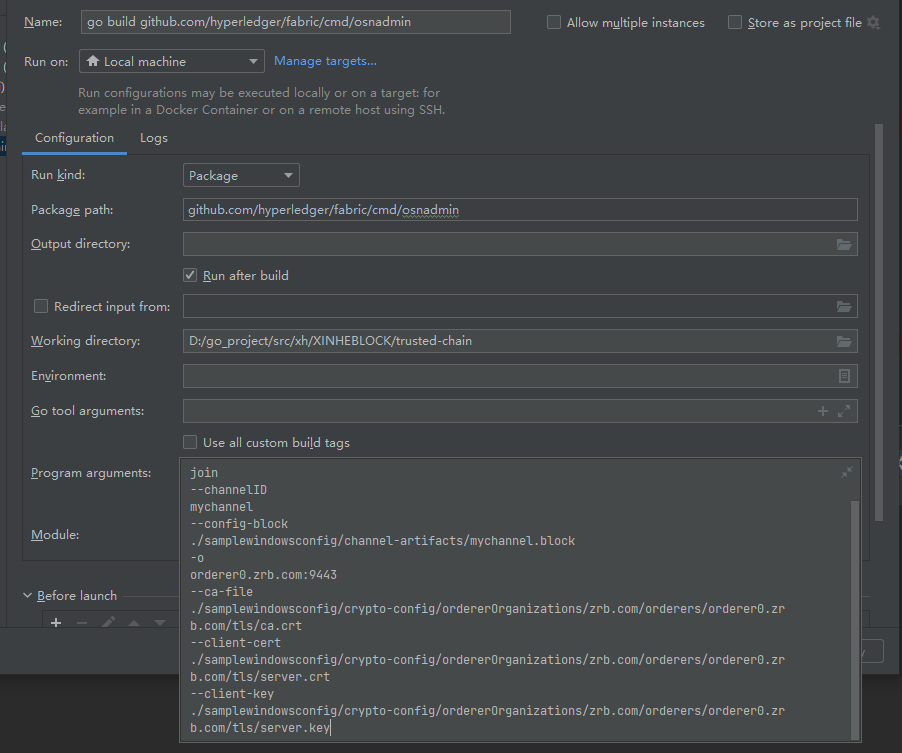
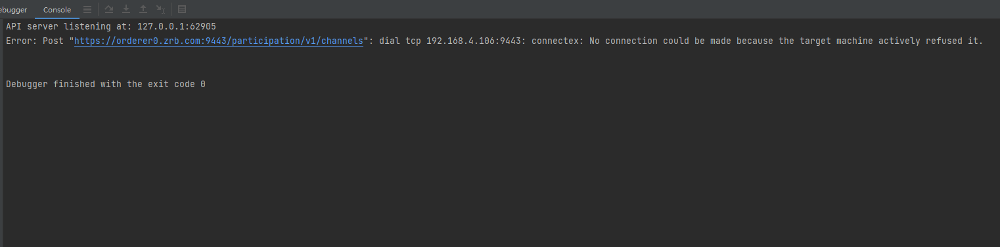
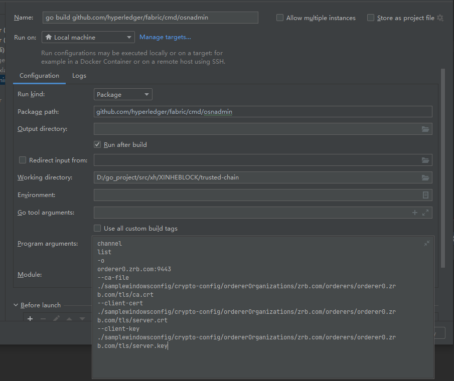

## osnadmin 工具

### 1、osnadmin工具入口
- [cmd/osnadmin/main.go](../../cmd/osnadmin/main.go)

### 2、使用osnadmin服务
#### 将orderer节点加入通道
- idea 启动
  
- 二进制文件
```shell
osnadmin channel join --channelID mychannel
--config-block 
./channel-artifacts/mychannel.block 
-o
orderer2.zrb.com:9445
--ca-file
./samplewindowsconfig/crypto-config/ordererOrganizations/zrb.com/orderers/orderer2.zrb.com/tls/ca.crt
--client-cert
./samplewindowsconfig/crypto-config/ordererOrganizations/zrb.com/orderers/orderer2.zrb.com/tls/server.crt
--client-key
./samplewindowsconfig/crypto-config/ordererOrganizations/zrb.com/orderers/orderer2.zrb.com/tls/server.key
```
- 加入通道被拒绝
  
  orderer.yaml文件中，ChannelParticipation.Enabled默认为关闭，该信息定义了是否提供参与通道的API，需要将其改为true，不然无法通过API接口对通道进行操作。

#### 查看加入的通道
- idea启动
  
- 二进制文件
```shell
osnadmin channel list
-o
orderer2.zrb.com:9445
--ca-file
./samplewindowsconfig/crypto-config/ordererOrganizations/zrb.com/orderers/orderer2.zrb.com/tls/ca.crt
--client-cert
./samplewindowsconfig/crypto-config/ordererOrganizations/zrb.com/orderers/orderer2.zrb.com/tls/server.crt
--client-key
./samplewindowsconfig/crypto-config/ordererOrganizations/zrb.com/orderers/orderer2.zrb.com/tls/server.key
```

