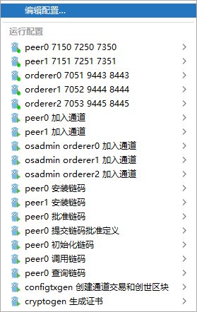

## Peer 节点初始化链码

### 1. peer初始化链码
- [cmd/peer/main.go](../../cmd/peer/main.go)

### 2. 启动peer批准链码必须带有参数
- 注意配置 hosts (`C:\Windows\System32\drivers\etc\hosts`)
```shell
127.0.0.1 peer0.org.dns.com
127.0.0.1 peer1.org.dns.com
127.0.0.1 orderer0.dns.com
127.0.0.1 orderer2.dns.com
127.0.0.1 orderer1.dns.com
127.0.0.1 chaincode.server.com 
```

- 使用`.run`目录下的idea启动文件启动

`.run/peer0 初始化链码.run.xml`



### 3. 配置文件环境变量 FABRIC_CFG_PATH

[sampleconfig=linux配置目录](../../sampleconfig)

[samplewindowsconfig=windows配置目录](../../samplewindowsconfig)
