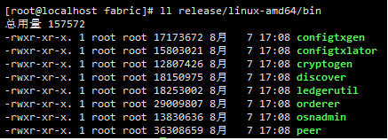

## 构建脚本
### 编译二进制文件
```shell
make release #编译所有工具
```
编译完成后，在release目录下会生成对应的二进制文件
 
### 编译docker镜像
```shell
make docker
```
参考：[docker编译文档](https://qr.dingtalk.com/page/yunpan?route=previewDentry&spaceId=21721467248&fileId=112742295345&type=file)
