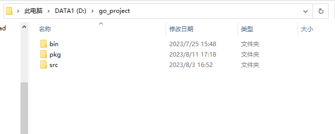

# 摘要
* 环境配置
  * golang 环境配置
    * 下载对应的[golang](https://golang.google.cn/dl/)(以压缩包为例)
    * 下载完成后解压到指定目录
    
    * 创建GOPATH目录（根据自己的实际情况选择对应的路径创建），在该目录下创建三个目录，分别为src（代码目录），pkg（通过go module下载的依赖包的存放目录），bin（go install 生成的二进制文件存放位置）
    
    * 配置环境变量
      * GOPATH:工程目录，即刚才创建的GOPATH目录
      * GOROOT:go 的安装路径
      * GOBIN:使用"go install"命令编译Go程序时，可执行文件会被放在GOBIN目录。即刚才创建的GOPATH/bin的路径
      * 将%GOROOT%\bin 添加到Path中
    * 通过 go version 验证是否配置成功
    

* [整体结构](整体结构.md)
* [核心过程](docs/process/README.md)
  * [peer 节点启动](docs/process/peer_start.md)
  * [orderer 节点启动](docs/process/orderer_start.md)
  * [创建通道和创世区块](docs/process/创建通道和创世区块.md)
  * [peer 加入通道](docs/process/peer加入通道.md)
  * [orderer 加入通道](docs/process/orderer加入通道.md)
  * [peer 安装链码](docs/process/peer安装链码.md)
  * [peer 批准链码](docs/process/peer批准链码.md)
  * [peer 提交链码批准定义](docs/process/peer提交链码批准定义.md)
  * [peer 初始化链码](docs/process/peer初始化链码.md)
  * [peer 调用链码](docs/process/peer调用链码.md)
  * [peer 查询链码](docs/process/peer查询链码.md)
  * [osnadmin 工具启动](docs/process/osnadmin启动文档.md)
  * [cryptogen 工具启动](docs/process/cryptogen启动文档.md)
  * [configtxgen 工具启动](docs/process/configtxgen启动文档.md)
* [构建脚本](构建脚本.md)
* [链码操作](链码操作.md)
